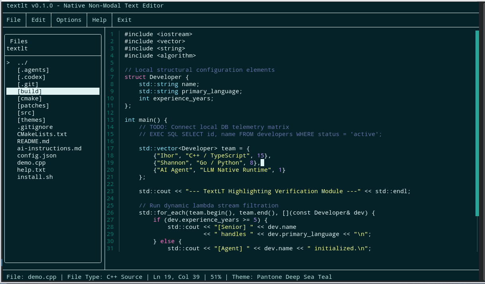

# textlt

`textlt` is a lightweight, blazing-fast, and highly customizable **Terminal User Interface (TUI)** text editor built from scratch in C++. Designed for modern developers who love the efficiency of the command line but prefer intuitive, modeless text editing over complex Vim/Emacs modal constraints.

Optimized to run perfectly in native Linux environments (**MX Linux**, **Ubuntu**, **Debian**) as well as **WSL (Windows Subsystem for Linux)**.

---

## Interface Preview



---

## Key Features

- **Intuitive Modeless Editing:** No "command" or "insert" modes. Just open, click, and start typing, exactly like modern GUI text editors.
- **Advanced Polyglot Syntax Highlighting:** Powered by an ultra-fast state-machine engine that pre-scans syntax layout matrices up to the active viewport boundaries:
  - **Languages:** `C++`, `C`, `PHP` (with native WordPress multi-language support), `Python`, `Ruby` (inc. `Gemfile`), `Java`, `JavaScript`, `TypeScript`, `HTML`, `XML`, `CSS`, `SQL`, `GraphQL`.
  - **Configurations:** `YAML`, `JSON`, `Dockerfile`, `docker-compose.yml`, `.ini`, `.conf`, and `.env` profiles.
- **Embedded Syntax Engine (Heredoc/Nowdoc):** Seamlessly shifts lexical token states inside PHP code streams when encountering `<<<HTML`, `<<<CSS`, or `<<<JS` blocks, matching enterprise IDE behavior.
- **Full Interactive Mouse Integration:**
  - Fluid drag-selection tracking mapped directly onto character coordinate structures.
  - Smooth terminal scroll-wheel navigation.
  - Single-click cursor repositioning and side-panel file manager navigation.
- **Smart Code Commenting:** Context-aware line/block comment toggling via `Ctrl + /` that dynamically inserts language-specific prefixes (`//`, `#`, `--`) aligned cleanly before the first non-whitespace character.
- **Native Viewport Scroller & Scrollbar:** Custom right-aligned vertical TUI Scrollbar indicating precise location markers. Viewport bounds are dynamically calculated, reserving space for status indicators and input panel obstructions.
- **Split Find & Replace Panels:** Dedicated bottom overlay UI regions for real-time text matching (`Ctrl+F`) and variable replacement (`Ctrl+R`) with color-blended highlighting.
- **Modern Layout Foundations:** Soft Tabs framework supporting configurable space injections (`2` or `4`), dynamic line jumping (`Ctrl+G`), and transaction-safe atomic Undo/Redo historical snapshots.

---

## Tech Stack

- **Core Engine:** Modern C++17 (Object-Oriented, clean module subsystem split)
- **UI Architecture:** [FTXUI](https://github.com/ArthurSonzogni/FTXUI) (Functional Terminal User Interface framework)
- **Build Core:** CMake & Bash Deployment Automations

---

## Getting Started

### Install from Release

#### Linux

Copy and paste this into Bash. Change `VERSION` to the release tag you want, for example `v1.0.0`.

```bash
VERSION="v1.0.0"
mkdir -p "$HOME/.local/bin"
wget -O /tmp/textlt-linux-x64.tar.gz "https://github.com/ihor-liutak2/textlt/releases/download/${VERSION}/textlt-linux-x64.tar.gz"
tar -xzf /tmp/textlt-linux-x64.tar.gz -C "$HOME/.local/bin"
chmod +x "$HOME/.local/bin/textlt"
grep -qxF 'export PATH="$HOME/.local/bin:$PATH"' "$HOME/.bashrc" || echo 'export PATH="$HOME/.local/bin:$PATH"' >> "$HOME/.bashrc"
grep -qxF 'export COLORTERM=truecolor' "$HOME/.bashrc" || echo 'export COLORTERM=truecolor' >> "$HOME/.bashrc"
grep -qxF 'export TERM=xterm-256color' "$HOME/.bashrc" || echo 'export TERM=xterm-256color' >> "$HOME/.bashrc"
source "$HOME/.bashrc"
textlt
```

After this, start the editor from any terminal with:

```bash
textlt path/to/file.cpp
```

#### Windows

Copy and paste this into PowerShell. Change `VERSION` to the release tag you want, for example `v1.0.0`.

```powershell
$VERSION = "v1.0.0"
$InstallDir = "$env:LOCALAPPDATA\Programs\textlt"
New-Item -ItemType Directory -Force -Path $InstallDir | Out-Null
wget "https://github.com/ihor-liutak2/textlt/releases/download/$VERSION/textlt-windows-x64.zip" -OutFile "$env:TEMP\textlt-windows-x64.zip"
Expand-Archive -Force "$env:TEMP\textlt-windows-x64.zip" -DestinationPath $InstallDir
$UserPath = [Environment]::GetEnvironmentVariable("Path", "User")
if ($UserPath -notlike "*$InstallDir*") { [Environment]::SetEnvironmentVariable("Path", "$UserPath;$InstallDir", "User") }
& "$InstallDir\textlt.exe"
```

Open a new terminal after installing so Windows reloads `PATH`, then start the editor with:

```powershell
textlt path\to\file.cpp
```

### Automated 1-Click Installation
The repository includes an intelligent interactive deployment script that installs missing dependencies (`build-essential`, `cmake`), compiles the binary in `Release` mode, safely copies it into your user local binary path, and updates your environment path configurations.

Simply clone and run the installer:
```bash
git clone [https://github.com/yourusername/textlt.git](https://github.com/yourusername/textlt.git)
cd textlt
chmod +x install.sh
./install.sh

```

*Note: After the script finishes, reload your shell profile via `source ~/.bashrc` to activate the global `textlt` command.*

###  Manual Compilation

If you prefer building manually, ensure you have a C++17 compliant compiler installed:

```bash
# Setup build workspace
cmake -B build -DCMAKE_BUILD_TYPE=Release
cmake --build build --parallel $(nproc)

# Execute local target
./build/textlt path/to/your/file.cpp

```

---

## Shortcuts Reference

| Shortcut | Action |
| --- | --- |
| `Ctrl + S` | Save current document buffer to disk |
| `Ctrl + /` | Toggle Smart Line/Block Comment (`//`, `#`, `--`) |
| `Ctrl + F` | Open Split Find Panel |
| `Ctrl + R` | Open Split Replace Panel |
| `Ctrl + G` | Open Go-To-Line prompt box |
| `Ctrl + Z` | Undo last atomic action |
| `Ctrl + Y` | Redo last reverted historical state |
| `Tab` | Insert Configurable Soft Tab (Spaces) |
| `F10` / `Mouse` | Activate global top bar dropdown menus |
| `Shift + Click` | Extend/Anchor block text selection via mouse |
| `Esc` | Close active dialogs / clear panel focus |

---

## Supported Ecosystem Matrix

Open the interactive **Help** window inside the editor at any time to view the live language support grid:

| Language / Context | File Extensions / Target Matchers | Comment Token |
| --- | --- | --- |
| **C++ / C** | `.cpp`, `.hpp`, `.h`, `.c`, `.cc`, `.cxx` | `//` |
| **Go** | `.go` | `//` |
| **Rust** | `.rs` | `//` |
| **PHP** | `.php` *(Supports Nested HTML/CSS/JS Heredocs)* | `//` |
| **Laravel Blade** | `.blade.php` *(HTML fallback plus Blade directives and PHP echo expressions)* | `{{-- --}}` / PHP |
| **JavaScript / TypeScript** | `.js`, `.mjs`, `.ts`, `.mts`, `.jsx`, `.tsx` | `//` |
| **Python** | `.py` | `#` |
| **Ruby** | `.rb`, `Gemfile` | `#` |
| **Java** | `.java` | `//` |
| **HTML / XML / CSS** | `.html`, `.htm`, `.xml`, `.xsd`, `.xsl`, `.xslt`, `.css` | `` / `<!-- -->` / `/* */` |
| **SQL** | `.sql` | `--` |
| **GraphQL** | `.graphql`, `.gql` | `--` |
| **YAML / Compose** | `.yaml`, `.yml`, `docker-compose.yml` | `#` |
| **Docker Engine** | `Dockerfile`, `Dockerfile.*` | `#` |
| **System Diagnostics** | `.ini`, `.conf`, `.json` | `;` / `#` / None |
| **Environment Configs** | `.env`, `.env.local`, `.env.production` | `#` |

---

## License

This project is licensed under the MIT License - see the [LICENSE](https://www.google.com/search?q=LICENSE) file for details.

```

---


```
